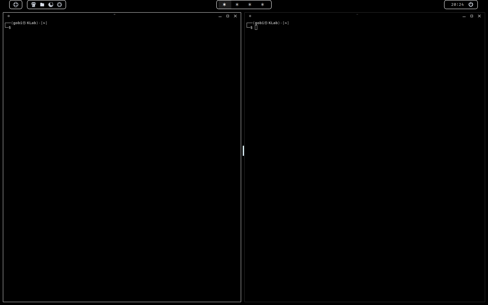
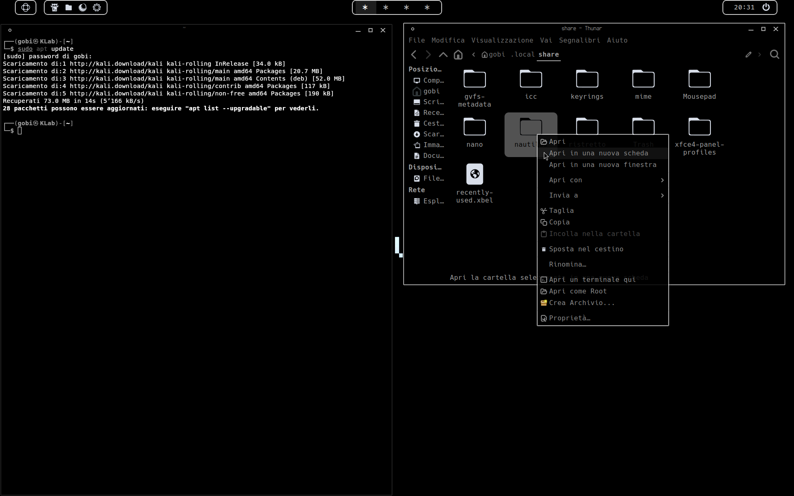

# BACK IN BLACK 
Elegant true #000000 black GTK3 theme. 

Back in Black aims to reduce visual noise and let content stand out by embracing simplicity and darkness.

• Pure black & white color palette

• Minimal and consistent styling

• Designed for clarity and focus

Based on [Mayu dark gtk theme](https://github.com/mrbrownstone07/Mayu_dark_gtk_theme) 


## Screenshots






## Installation

Run the following commands in the terminal:
```
git clone https://github.com/mojaveling/back-in-black-theme.git
cp -r back-in-black-theme ~/.themes/
```
**OR**

If you prefer not to use Git, you can install Back in Black manually:

1. Download the ZIP file from this repository: [Download ZIP](https://github.com/mojavelin/back-in-black-theme/archive/refs/heads/main.zip)

2. Extract the ZIP file. You will get a folder name `back-in-black-theme-main` .

3. Move the extracted folder to your themes directory:

   - **For a single user:**  
     Copy `back-in-black-theme-main` to `~/.themes/`  
     *(create the `.themes` folder in your home directory if it doesn't exist)*

   - **For all users:**  
     Copy it to `/usr/share/themes/` (requires root privileges)

4. Open your **Appearance** and **Window Manager** settings and select **Back in Black**.

## Icon 
Back in Black theme use 

**Yet Another Monochrome Icon Set**: https://bitbucket.org/dirn-typo/yet-another-monochrome-icon-set

**Download**: https://store.kde.org/p/2303161 
